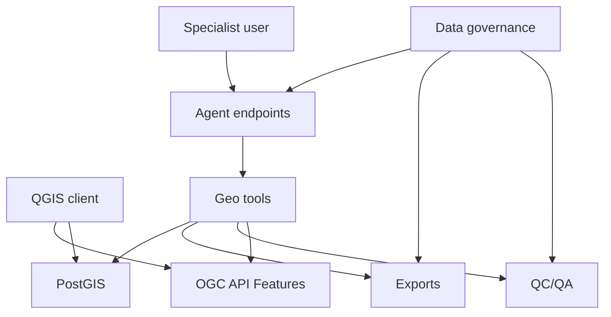
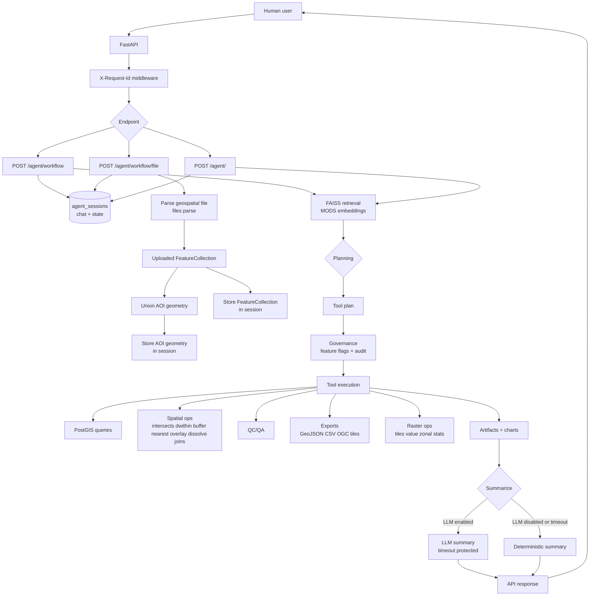

## Geo_Cortex_Assistant (Backend)

Backend-only geospatial platform for geospatial scientists: **PostGIS + RAG + an agentic workflow layer** that turns natural language into **multi-step geospatial operations** with **traceability** (plan + tool trace), **GIS-ready outputs**, and **chart payloads**.

### Quick links

- **Swagger UI**: `http://127.0.0.1:8000/docs`
- **OpenAPI JSON**: `http://127.0.0.1:8000/openapi.json`
- **Health**: `http://127.0.0.1:8000/health`

### Docs (organized)

- **Quick start (5–10 min)**: `QUICKSTART.md`
- **Full setup + optional dependencies**: `SETUP.md`
- **Complete reference (pipelines + endpoints + data model)**: `DOCUMENTATION.md`

## What you can do

- **Ask questions conversationally**: `/agent/workflow` and `/agent/workflow/file`
- **Run complex spatial ops**: intersects/dwithin/buffer/nearest + overlay/dissolve + spatial joins
- **Export + publish to GIS**: GeoJSON/CSV, OGC API Features for QGIS, MVT tiles
- **QA/QC**: duplicates/outliers/summary checks
- **Optional raster workflows**: upload, tiles, sampling, zonal stats

## Architecture (high level)

### System flowchart (pipelines)



### Agentic system flowchart (internal)



## Repo structure

```
Geo_Cortex_Assistant/
├── app/                 # API + services
├── scripts/             # utilities + demo scripts
├── demo_inputs/         # demo GeoJSON inputs
├── tests/               # pytest integration tests
├── MODS.csv             # dataset source (also used for embeddings)
└── audit.log            # governance audit (JSON lines)
```

## Evaluated performance (how to reproduce)

Run the “defensible accuracy” report (golden + holdout, Wilson 95% lower bounds):

```bash
python scripts/report_accuracy_claims.py
```

Useful knobs:

- `CLAIM_RAG_K=5` (default 5)
- `CLAIM_LLM_N=25` (workflow sample size per set)
- `EVAL_TIMEOUT_SEC=45` (HTTP timeout per workflow call)
