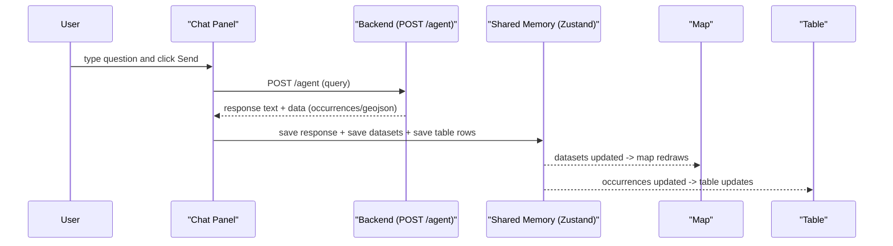
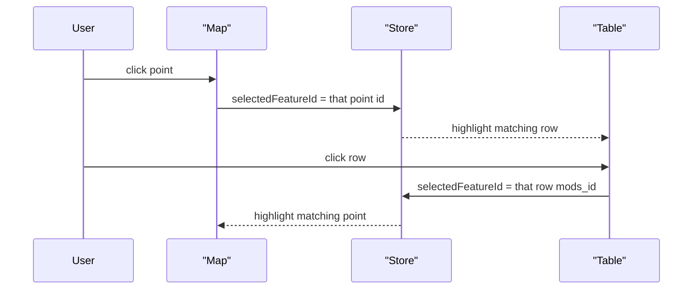
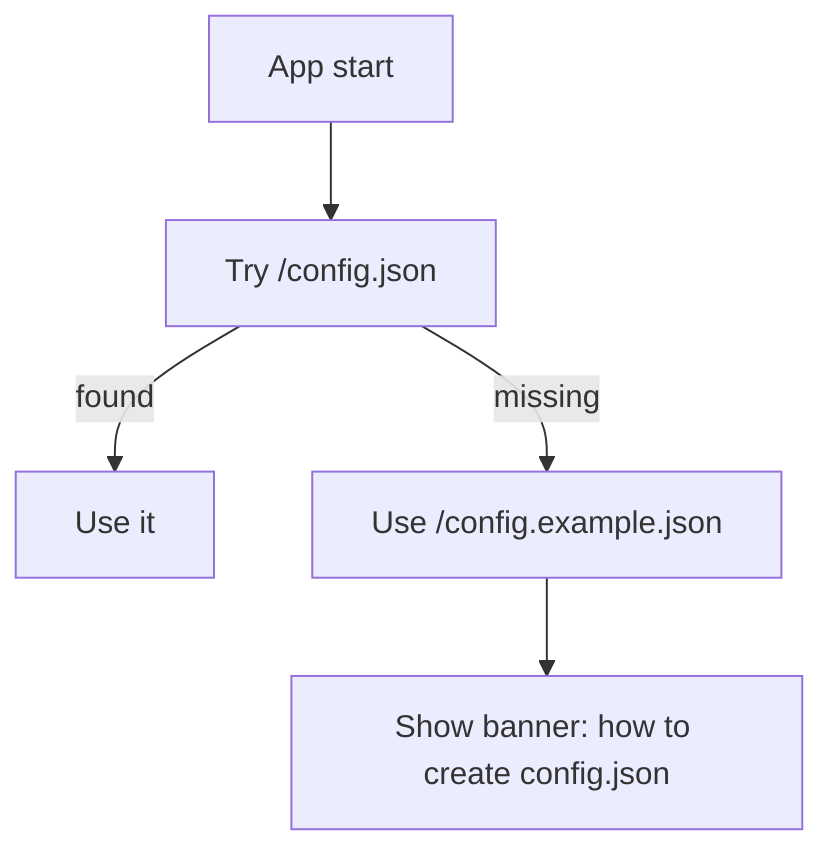

# Geo Cortex Assistant UI — Frontend (Beginner-Friendly Technical Documentation)

This document explains the frontend **as if you’re new to frontend development**. It still includes diagrams and details, but with simple language and real examples.

---

## Read this first (simple definitions)

- **Frontend**: the web page you see in the browser (map, table, chat, buttons).
- **Backend**: the server running in the background (FastAPI). It answers requests from the frontend.
- **API**: the “door” the frontend uses to talk to the backend (example: `POST /agent`).
- **State**: shared “memory” for the app (what data is loaded, what’s selected, which map style is active).
- **Zustand store**: a small library we use to hold that shared memory in one place.
- **GeoJSON**: a standard file format for map shapes (points, lines, polygons).
- **Mapbox**: the map engine that draws the map, terrain, and built-in layers.
- **deck.gl**: an extra engine for advanced layers like 3D hexagons.

If you remember only one thing:
> The **chat** asks the backend for data, then the frontend saves the results in the **store**, and the **map + table** read from the store to show them.

---

## What the user sees (UI layout)

The page is split into 3 main panels:
- **Left**: Layers (you can change how the data is drawn)
- **Middle**: Map (top) + Table (bottom)
- **Right**: Chat (you can collapse it)

### Layout diagram

```mermaid
flowchart TB
  subgraph Layout[Resizable Layout]
    L[Layers (left)]
    subgraph Center[Center]
      M[Map (top)]
      T[Table (bottom)]
    end
    C[Chat (right, collapsible)]
  end
```

Where this is implemented:
- `src/ui/App.tsx` builds this resizable layout.

---

## Big picture: how everything connects

### Architecture chart (simple explanation)

```mermaid
flowchart LR
  subgraph Browser[Browser]
    UI[UI Panels (React)]
    Store[(Shared App Memory: Zustand Store)]
    Map[Mapbox Map]
    Deck[deck.gl Layer Overlay]
  end

  subgraph Backend[FastAPI Backend]
    Agent[/POST /agent/]
  end

  UI <--> Store
  UI -->|Ask a question| Agent
  Agent -->|Answer + data| UI
  Store -->|datasets| Map
  Store -->|hex datasets| Deck
  Deck -->|draws on| Map
```

How to read it:
- The **UI** (chat/layers/table) reads & writes the **Store**.
- The **Chat** calls the backend (`POST /agent`).
- The backend returns data (like occurrences and GeoJSON).
- The frontend saves that data into the **Store**.
- The **Map** and **Table** show whatever is in the Store.

---

## The shared memory (Zustand store) — explained simply

Think of the **Zustand store** like a shared notebook:
- Any panel can write to it.
- Any panel can read from it.
- This is how map/table/chat stay in sync without messy wiring.

Stored things include:
- **config**: backend URL + Mapbox token
- **datasets**: GeoJSON data for the map
- **occurrences**: rows for the table
- **selectedFeatureId**: which point is selected (map ↔ table sync)
- **terrainSurface**: map style choice (Original / Satellite / Street)

Where it is implemented:
- `src/store/appStore.ts`

---

## What happens when you send a chat message? (step-by-step)

### Sequence diagram



Plain-language explanation:
- You ask the agent something.
- The chat sends that text to the backend.
- The backend responds with:
  - **text** (the assistant answer)
  - sometimes **data** (points/polygons)
- The frontend stores the data in the “shared notebook” (store).
- The map and table automatically update.

Where it is implemented:
- Chat + applying data: `src/ui/panels/ChatPanel.tsx`
- API call function: `src/api/agent.ts`

---

## What happens when you click a point on the map? (map ↔ table sync)

### Selection sync diagram



Plain-language explanation:
- We store just **one number/string**: the selected id.
- Both map and table look at that selected id.
- That’s why clicking either one highlights the other.

Where it is implemented:
- Map click + highlight filter: `src/ui/map/MapView.tsx`
- Table row click + highlight: `src/ui/table/DataTablePanel.tsx`

---

## Map drawing (what “Scatter / Heatmap / Hexagon” mean)

Each dataset (layer) can be drawn in different ways:
- **Scatter**: draw every point as a circle
- **Heatmap**: show density (more points = hotter colors)
- **Hexagon (3D)**: group points into hex bins, draw 3D columns

Where it is implemented:
- Layer UI controls: `src/ui/panels/LayersPanel.tsx`
- Map drawing logic: `src/ui/map/MapView.tsx`

Why we use two libraries:
- **Mapbox** is great for basemap + basic layers + 3D terrain.
- **deck.gl** is great for advanced 3D aggregated layers (hex bins).

---

## “Surface” (Original / Satellite / Street) explained

“Surface” is the **basemap style** (how the background map looks).

- **Original**: whatever you set in `public/config.json` as `mapbox.style`
- **Satellite**: Mapbox satellite style
- **Street**: Mapbox streets style

Important detail:
> When you change style, Mapbox forgets custom layers, so we re-add them on `style.load`.

Where it is implemented:
- UI dropdown: `src/ui/panels/LayersPanel.tsx`
- Map style switching: `src/ui/map/MapView.tsx`

---

## Configuration (how the frontend knows the backend URL and Mapbox token)

You create:
- `public/config.json` (not committed to git)

The app loads it at startup:
- If missing, it loads `public/config.example.json` and shows a hint banner.



Where it is implemented:
- Config loader: `src/config/loadConfig.ts`

---

## Running locally (Windows / PowerShell)

```powershell
cd .\frontend
Copy-Item .\public\config.example.json .\public\config.json
notepad .\public\config.json
npm install
npm run dev -- --host 127.0.0.1 --port 5173
```

---

## File map (where to look)

- **Start / entry**: `src/main.tsx`
- **Layout (panels)**: `src/ui/App.tsx`
- **Map**: `src/ui/map/MapView.tsx`
- **Chat**: `src/ui/panels/ChatPanel.tsx`
- **Layers**: `src/ui/panels/LayersPanel.tsx`
- **Table**: `src/ui/table/DataTablePanel.tsx`
- **Shared memory (store)**: `src/store/appStore.ts`
- **Config**: `src/config/loadConfig.ts`
- **API calls**: `src/api/*`
- **Types (shapes of data)**: `src/types/*`

---

## Advanced section (for later)

If/when you want more detail, these are the “technical knobs”:
- dataset naming prefixes: `gc-src:*` and `gc-lyr:*`
- Mapbox layers used: `circle`, `heatmap`, `sky`, and terrain DEM
- deck.gl layer used: `HexagonLayer` via `MapboxOverlay`
- typed API contracts in `src/types/api.ts`

